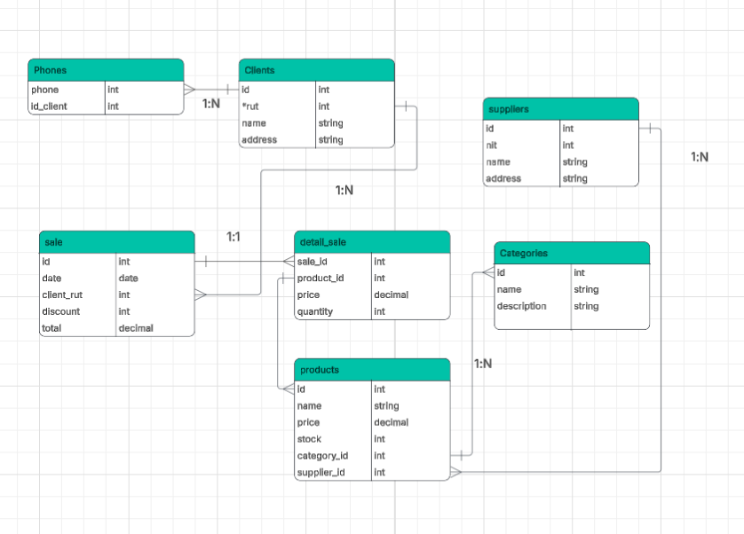

# Sistema de Gestión de Ventas

Este proyecto es una aplicación completa de gestión de ventas que incluye un backend API desarrollado con NestJS y una interfaz frontend construida con React, TypeScript y Vite.

## Arquitectura del Proyecto

El proyecto está dividido en dos partes principales:

- **API Backend** (`/api`): Servidor REST API construido con NestJS y TypeScript
- **Frontend** (`/fronted`): Interfaz de usuario moderna construida con React, TypeScript y Vite

## Tecnologías Utilizadas

### Backend (API)
- **NestJS**: Framework de Node.js para aplicaciones server-side escalables
- **TypeScript**: Tipado estático para JavaScript
- **PostgreSQL**: Base de datos relacional
- **TypeORM**: ORM para TypeScript

### Frontend
- **React**: Biblioteca para interfaces de usuario
- **TypeScript**: Tipado estático
- **Vite**: Herramienta de construcción rápida
- **Tailwind CSS**: Framework CSS utilitario
- **Axios**: Cliente HTTP para peticiones API
- **React Hook Form**: Manejo de formularios
- **Zod**: Validación de esquemas
- **Shadcn/ui**: Componentes UI reutilizables

## Requisitos Previos

Antes de ejecutar el proyecto, asegúrate de tener instalados:

- **Node.js** (versión 18 o superior)
- **npm** o **yarn**
- **Docker** y **Docker Compose** (opcinal - para ejecutar la BD)
- **PostgreSQL** (si no usas Docker)

## Instalación y Configuración

### 🚀 Inicio Rápido (Recomendado)

1. **Clona el repositorio:**
   ```bash
   git clone <https://github.com/YeissonOsorno/sales_app>
   cd sales_app
   ```

2. levanta la BD con docker-compose up -d
3. Instala dependecias en frontend y api folders (cd api && npm i ), (cd frontend && npm i)

4. levanta front - npm run dev
5. levanta back - npm run start:dev
## Estructura del Proyecto

```
sales_app/
├── api/                    # Backend API (NestJS)
│   ├── src/
│   │   ├── modules/        # Módulos de la aplicación
│   │   │   ├── clients/    # Gestión de clientes
│   │   │   ├── products/   # Gestión de productos
│   │   │   ├── sales/      # Gestión de ventas
│   │   │   └── ...
│   │   ├── common/         # Código compartido
│   │   │   ├── db/         # Configuración de base de datos
│   │   │   └── models/     # Entidades de base de datos
│   │   └── main.ts         # Punto de entrada
│   └── package.json
├── fronted/                # Frontend (React + Vite)
│   ├── src/
│   │   ├── components/     # Componentes React
│   │   ├── hooks/          # Hooks personalizados
│   │   ├── pages/          # Páginas de la aplicación
│   │   ├── lib/            # Utilidades
│   │   └── api/            # Configuración de API
│   ├── public/             # Archivos estáticos
│   └── package.json
├── docker-compose.yml      # Configuración de Docker
└── README.md
```

## Funcionalidades

### Gestión de Clientes
- ✅ Crear nuevos clientes
- ✅ Listar todos los clientes
- ✅ Editar información de clientes existentes
- ✅ Eliminar clientes
- ✅ Buscar clientes por nombre, RUT o dirección

## API Endpoints

### Clientes
- `GET /clients` - Obtener todos los clientes
- `POST /clients` - Crear un nuevo cliente
- `GET /clients/:id` - Obtener un cliente específico
- `PATCH /clients/:id` - Actualizar un cliente
- `DELETE /clients/:id` - Eliminar un cliente


## Scripts Disponibles

### Comandos Principales (desde la raíz del proyecto)

### Problemas Comunes

1. **Error de conexión a la base de datos:**
   - Verifica que PostgreSQL esté ejecutándose
   - Revisa las credenciales en las variables de entorno

2. **Error de CORS:**
   - Asegúrate de que la API esté configurada para aceptar peticiones del frontend

3. **Errores de dependencias:**
   - Ejecuta `npm install` en ambas carpetas (api y fronted)

4. **Puerto ocupado:**
   - Cambia los puertos en la configuración si hay conflictos


